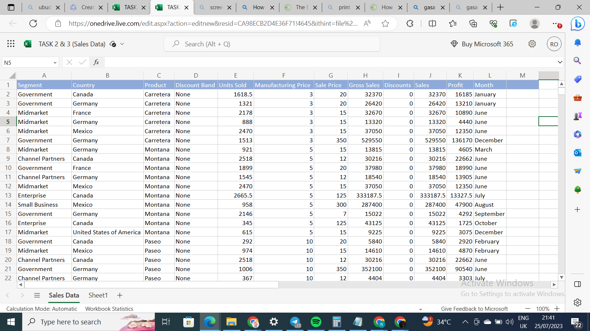
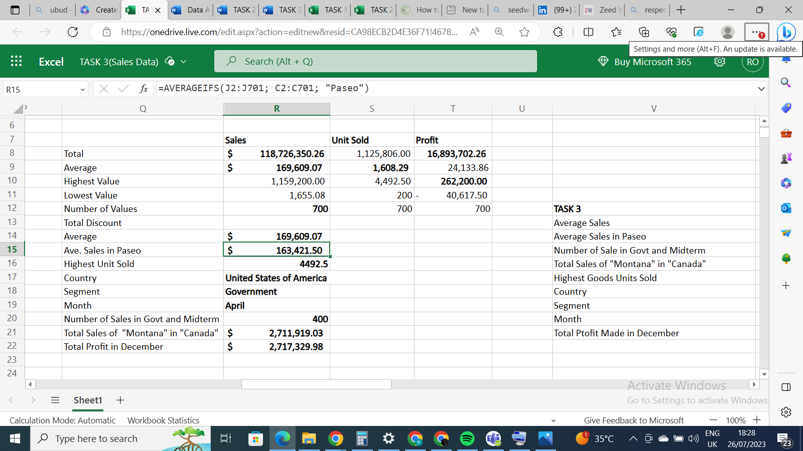
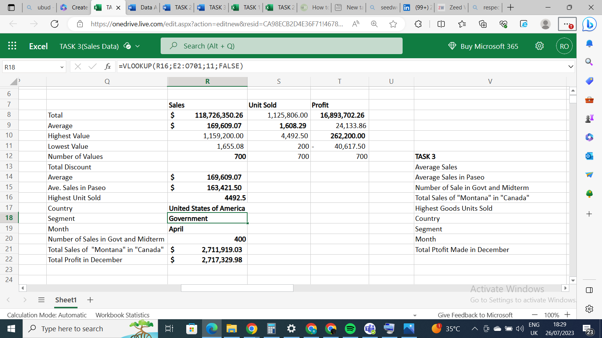
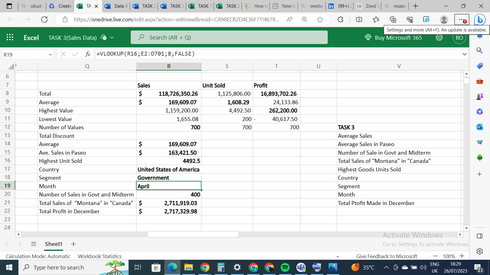

# Data-Analytics-Cohort-3-TASK-3

 ## Introduction 
Using the same dataset, this third task of the 3rd Data Analytics Cohort for beginners is a continuum of the basic understanding and usage of basic and advanced functions in Excel.   

## TASK 
We are required to calculate the following: 

- The average revenue generated from each sale of Paseo. 
- The number of sales made in the Government and Midmarket Segment 
- Total revenue generated from the sales of “Montana” in Canada 
- In which Country, Segment, and Month was the highest unit of goods sold? 
- What is the total profit made in December? 

 ## Skills Consideration 
1. Data Manipulation 
2. VLOOKUP 
3. XLOOKUP 
4. COUNTIF 
5. COUNTIFS 
6. AVERAGEIFS 

## Dataset 

 

## AVERAGEIFS 

To calculate the average revenue generated from sales in “Paseo”, I used the AVERAGEIFS Function =AVERAGEIF (range, criteria, [average_range]) With J2:J701 as the range, "Paseo" as the criteria and [C2:C701] as [average_range] 

 ## COUNTIFS 
 To return the number of sales of Government and MidMarket, I used the COUNTIFS Function, =COUNTIFS, I calculated each individually and added the 2 ranges together. (A2:A701:A3)+(A2:A701:A4) 
 
 
 
## MAX
To calculate the highest units of goods sold, I used the MAX Function, =MAX of the range E2:E701.

 ## VLOOKUP 
 After getting the highest units of goods sold, I used the VLOOKUP Function, =VLOOKUP. to look up the segment, country, and month that feat was achieved. And it returned as indicated in the images.

 
 
 

 ## Conclusion 
With this task, I can say categorically that my knowledge of advanced functions in Excel has improved. 
Thank you. 

 

 
